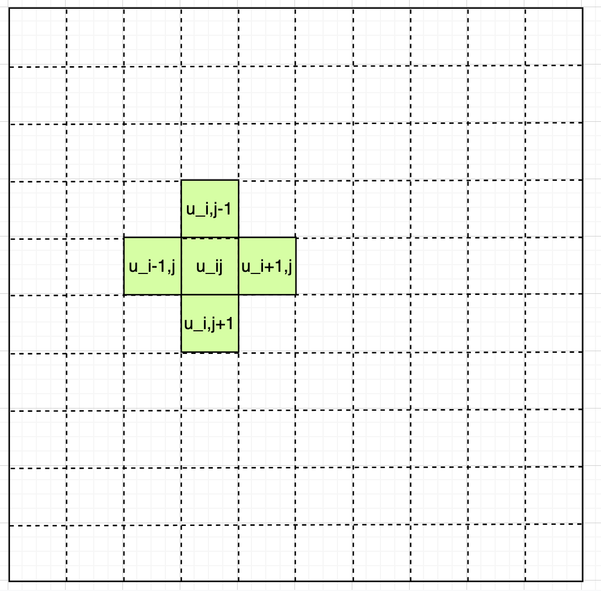

> https://rachelbhadra.github.io/smoke_simulator/index.html

[【manim 物理模拟】流体](https://www.bilibili.com/video/BV1z34y1C7o4?p=1&share_medium=iphone&share_plat=ios&share_session_id=DE0A9594-B51F-44FC-99DF-ABEFFB83F4D1&share_source=WEIXIN&share_tag=s_i&timestamp=1645254074&unique_k=X6DRxFr)

#### 0 近似求解线性方程组

使用高斯-塞德尔迭代

#### 1 Navier-Stokes 方程

不可压缩流体的条件下, 纳维－斯托克斯方程（Navier-Stoke equation）分为**动量守恒公式**

$$
\frac{\partial\boldsymbol{v}}{\partial t} +
(\boldsymbol{v} \cdot \nabla)\boldsymbol{v} = -
\frac{1}{\rho}\nabla p+ \nu \nabla^2\boldsymbol{v} + f
$$

[图片出处](https://zh.wikipedia.org/wiki/%E7%BA%B3%E7%BB%B4-%E6%96%AF%E6%89%98%E5%85%8B%E6%96%AF%E6%96%B9%E7%A8%8B)

和**质量守恒**公式:
$$\nabla \cdot \boldsymbol{v} = 0$$

$\boldsymbol{v}(x,y,t)$ 速度矢量
$\rho(x,y,t)$ 液体密度
$\nu$ 是运动粘度 (常数)
$p$ 压力 (常数)
F 位体积流体受的外力
将速度矢量$\boldsymbol{v}$拆成(u,v)的分量形式:

$$
\frac{\partial{u}}{\partial t} + u \frac{\partial{u}}{\partial x} + v \frac{\partial{u}}{\partial y} = - \frac{1}{\rho} \frac{\partial{p}}{\partial x} + \mu (\frac{\partial^2{u}}{\partial x^2 } + \frac{\partial^2{u}}{\partial y^2})
$$

$$
\frac{\partial{v}}{\partial t} + u \frac{\partial{v}}{\partial x} + v \frac{\partial{v}}{\partial y} = - \frac{1}{\rho} \frac{\partial{p}}{\partial x} + \mu (\frac{\partial^2{v}}{\partial x^2 } + \frac{\partial^2{v}}{\partial y^2})
$$

这就是二维直角坐标系中 N-S 方程的分量形式。

#### 2 导数的数值求法

包含两种:

$$
\frac{df}{\partial x} \approx \frac{f(x+\Delta x) - f(x)}{\Delta x}
$$

$$
\frac{df}{\partial x} \approx \frac{f(x+\Delta x) - f(x-\Delta)}{2\Delta x}
$$

#### 3 导数离散化

- 共 n 行,m 列
- 每个格子的大小是 $\Delta x * \Delta y$
- 格子原点在左上角
- 格子坐标(i,j)

$u$对 $x$ 的一阶偏导可以近似计算为:

$$
\frac{\partial u}{\partial x} \approx \frac{u_{i,j} - u_{i-1,j}}{\Delta x} \approx \frac{u_{i+1,j} - u_{i-1,j}}{2\Delta x}
$$

$u$对 $x$ 的二阶偏导可以近似计算为:

$$
\frac{\partial^2 u}{\partial x^2} \approx \frac{u_{i+1,j} - 2u_{i,j}+ u_{i-1,j}}{\Delta x^2}
$$

$u$对的 $y$ 的一阶段偏导可以近似计算为:

$$
\frac{\partial u}{\partial y} \approx \frac{u_{i,j} - u_{i,j-1}}{\Delta y} \approx \frac{u_{i,j+1} - u_{i,j-1}}{2\Delta y}
$$

#### 3 N-S 偏导方程离散化

N-S 的离散形式:

$$
 \frac{u_{i,j}^{n+1} - u_{i,j}^n}{\Delta t} +
 u_{ij}^n \frac{u_{i,j}^{n} - u_{i-1,j}^n}{\Delta x} +
 v_{ij}^n \frac{u_{i,j}^{n} - u_{i-1,j}^n}{\Delta y} =
 -\frac{1}{\rho} \frac{p_{i+1,j}^{n} - p_{i-1,j}^n}{2\Delta x} +
 \mu(
   \frac{u_{i+1,j}^n - 2u_{i,j}^n + u_{i-1,j}^n}{\Delta x^2} +
   \frac{u_{i+1,j}^n - 2u_{i,j}^n+ u_{i-1,j}^n}{\Delta y^2}
  )
$$

$$
 \frac{v{i,j}^{n+1} - v_{i,j}^n}{\Delta t} +
 v_{ij}^n \frac{v_{i,j}^{n} - v_{i-1,j}^n}{\Delta x} +
 v_{ij}^n \frac{v_{i,j}^{n} - v_{i-1,j}^n}{\Delta y} =
 -\frac{1}{\rho} \frac{p_{i+1,j}^{n} - p_{i-1,j}^n}{2\Delta y} +
 \mu(
   \frac{v_{i+1,j}^n - 2v_{i,j}^n + v_{i-1,j}^n}{\Delta x^2} +
   \frac{v_{i+1,j}^n - 2v_{i,j}^n+ v_{i-1,j}^n}{\Delta y^2}
  )
$$

由此:

$$
 u_{i,j}^{n+1} =
 u_{i,j}^n + \Delta t
 \left [
 -u_{ij}^n \frac{u_{i,j}^{n} -u_{i-1,j}^n}{\Delta x}
 -v_{ij}^n \frac{u_{i,j}^{n} - u_{i-1,j}^n}{\Delta y}
 -\frac{1}{\rho} \frac{p_{i+1,j}^{n} + p_{i-1,j}^n}{2\Delta x} +
 \mu(
   \frac{u_{i+1,j}^n - 2u_{i,j}^n + u_{i-1,j}^n}{\Delta x^2} +
   \frac{u_{i+1,j}^n - 2u_{i,j}^n+ u_{i-1,j}^n}{\Delta y^2}
  )
\right ]
$$

$$
 v_{i,j}^{n+1} =
 v_{i,j}^n + \Delta t
 \left [
 -v_{ij}^n \frac{v_{i,j}^{n}
 -v_{i-1,j}^n}{\Delta x}
 -v_{ij}^n \frac{u_{i,j}^{n} - v_{i-1,j}^n}{\Delta y}
 -\frac{1}{\rho} \frac{p_{i+1,j}^{n} + p_{i-1,j}^n}{2\Delta x} +
 \mu(
   \frac{v_{i+1,j}^n - 2v_{i,j}^n + v_{i-1,j}^n}{\Delta x^2} +
   \frac{v_{i+1,j}^n - 2v_{i,j}^n+ v_{i-1,j}^n}{\Delta y^2}
  )
\right ]
$$

#### 4 不可压缩性

要求向量$\boldsymbol v$的散度为零。
$$\nabla \cdot \boldsymbol{v} = 0$$

转换为关于压强的柏松方程:

$$
\frac{\Delta t}{\rho} \nabla^2 p =-\nabla \cdot v
$$

离散化:

$$
\frac{p_{i+1,j}^{n} - 2p_{i,j+1}^n + p_{i-1,j}^n}{\Delta x^2} - \frac{p_{i,j+1}^{n} - 2p_{i,j}^n + p_{i,j-1}^n}{\Delta y^2} =
\frac{\Delta t}{\rho}
\left (
 \frac{u_{i+1,j}^n -  u_{i-1,j}^n}{2\Delta x} +
 \frac{v_{i+1,j}^n -  v_{i-1,j}^n}{2\Delta x}
\right)
$$

整理:

$$
p_{i,j}^{n} =
\frac{
  (p_{i+1,j}^n + p_{i-1,j}^n )\Delta x^2 +
  (p_{i,j+1}^n + p_{i,j-1}^n )\Delta y^2 -
  \frac{\Delta t}{\rho}
  \left (
  \frac{u_{i+1,j}^n -  u_{i-1,j}^n}{2\Delta x} +
  \frac{v_{i+1,j}^n -  v_{i-1,j}^n}{2\Delta x}
  \right)\Delta x^2 \Delta y^2
  }
{2\Delta x^2 \Delta y^2}
$$

带入边界条件, 使用高斯-塞德尔迭代求解。

#### ADVECTION(平流)

$$q(\mathbf{x}, t + \delta t) = q(\mathbf{x} - \mathbf{u}(\mathbf{x}, t) \delta t, t)$$

请注意，q 可以表示流体特性密度、速度和温度。在我们的项目中，我们使用了 1.0 的时间步长值。

#### BUOYANCY(浮力)

$$f_{buoy} = (-\kappa d + \sigma (T - T_0))\mathbf{\hat{j}}$$

#### VORTICITY(涡度)

$$f_{vc} = \varepsilon (\Psi \times \omega) \delta x$$

#### PRESSURE

$$x_{i,j}^{(k+1)}=\frac{x_{i-1,j}^{(k)}+x_{i+1,j}^{(k)}+x_{i,j-1}^{(k)}+x_{i,j+1}^{(k)}+\alpha b_{i,j}}{\beta}$$

$$\mathbf{u}=\mathbf{w}-\nabla p$$
