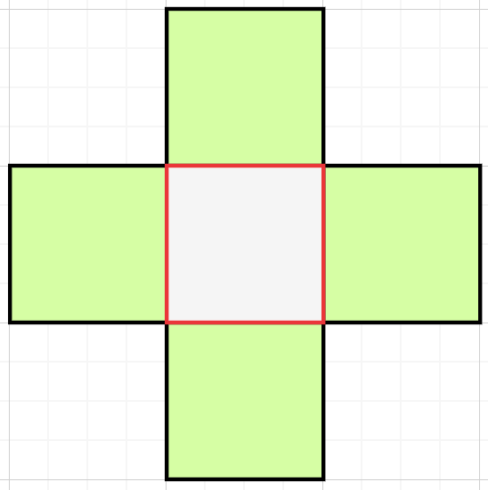

#### 2d

$$
d(i,j) = 红色方块的密度 \\
$$

$$
s(i,j) = \frac{d(i-1,j)+d(i+1,j)+d(i,j-1)+d(j+1)}{4}, 周围方块密度的平均值
$$

$$
k: 改变的量,由时间步长和流体粘度因素变化
$$

我们试图从当前密度,得到下一次迭代的密度, 目标是让 d 逐渐变成 s

$$
d(i,j)   -> s(i,j)
$$

逐渐改变值的一种方法是从当前密度开始，然后再加上它和周围平均值之间的差值:

$$
d_n = d_c + k(s_c-d_c)
$$

这是一个线性插值,当 k>1 时,实际上会达到目标值,并超过它。

解决方案不是仅使用当前值来计算下一个值,我们试图找到下一个值,把它倒回时间,得到当前值。

$$
d_c = d_n-k(s_n-d_n)
$$

整理:

$$
s_n = \frac{d_n(i-1,j)+d_n(i+1,j)+d_n(i,j-1)+d_n(j+1)}{4} \\
d_n = \frac{d_c+ks_n}{1+k}
$$

此时变成双曲关系,而不是线性关系.
