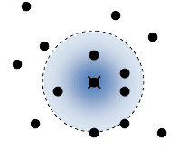
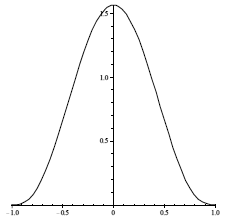
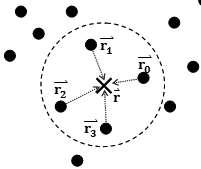

> https://blog.csdn.net/m0_38055352/article/details/88377773

### SPH

#### 受力分析

SPH 算法的基本设想，就是将连续的流体想象成一个个相互作用的微粒，这些例子相互影响，共同形成了复杂的流体运动，对于每个单独的流体微粒，依旧遵循最基本的牛顿第二定律:

$$
\boldsymbol{F} = m \boldsymbol{a} \tag{2-1}
$$

这是我们分析的基础，在 SPH 算法里，流体的质量是由流体单元的密度决定的，所以一般用密度代替质量:

$$
\boldsymbol{F} = \rho \boldsymbol{a} \tag{2-2}
$$

作用在一个微粒上的作用力由三部分组成:

$$
\boldsymbol{F} = \boldsymbol{F^{external}} + \boldsymbol{F^{pressure}} + \boldsymbol{F^{viscosity}} \tag {2-3}
$$

$\boldsymbol{F^{external}} $,称为外部力，一般就是重力:

$$
\boldsymbol{F^{external}} = \rho \boldsymbol{g} \tag {2-4}
$$

$\boldsymbol{F^{pressure}}$,是由流体内部的压力差产生的作用力数值上，它等于压力场的梯度

$$
\boldsymbol{F^{pressure}} = -\nabla p \tag {2-5}
$$

$\boldsymbol{F^{viscosity}}$,是由粒子之间的速度差引起的，设想在流动的液体内部，快速流动的部分会施加类似于剪切力的作用力到速度慢的部分，这个力的大小跟流体的粘度系数$\mu$以及速度差有关:

$$
\boldsymbol{F^{viscosity}} = \mu \nabla^2\boldsymbol{v} \tag {2-6}
$$

带入 2-2 有:

$$
\rho \boldsymbol{a} = \rho \boldsymbol{g}- -\nabla p+ \mu \nabla^2\boldsymbol{v}   \tag {2-7}
$$

加速度形式：

$$
\overrightarrow{a} = \overrightarrow{g}- \frac{\nabla p}{\rho}+\frac{\mu \nabla^2\overrightarrow{u}}{\rho}   \tag{2.8}
$$

#### 表面张力

实际运算过程中，有时还要考虑表面张力的影响，所谓表面张力大家应该并不陌生，肥皂泡、毛细管等有趣的物理现象都跟表面张力有关，这个力可以简单理解为流体试图减小表面而产生的力。

由于表面张力只涉及到表层的粒子，所以计算方法和上面的有所不同，这部分会在以后的章节介绍。

经过上面的分析，我们基本上搞清楚了 SPH 粒子的运动计算方法，下节我们将正式开始介绍 SPH 算法的关键部分，如何通过光滑核函数计算粒子运动规律。

### 三 光滑核函数

和其他流体力学中的数学方法类似，SPH 算法同样涉及到“光滑核”的概念，可以这样理解这个概念，粒子的属性都会“扩散”到周围，并且随着距离的增加影响逐渐变小，这种随着距离而衰减的函数被称为“光滑核”函数，最大影响半径为“光滑核半径”。

 

反过来不难理解，尽管我们将流体视为一个个分散的粒子，但流体毕竟是连续充满整个空间的，流体中每个位置参与运算的值都是由周围一组粒子累加起来的。

设想流体中某点$\overrightarrow{r}$（此处不一定有粒子）,在光滑核半径 $h$ 范围内有数个粒子，位置分别是$\overrightarrow{r_0},\overrightarrow{r_1},\overrightarrow{r_2},...,\overrightarrow{r_j}$，则该处某项属性 A 的累加公式为:

$$
A(\overrightarrow{r}) = \sum_{j} A_j \frac{m_j}{\rho_j} W(\overrightarrow{r} -  \overrightarrow{r_j}, h) \tag{3-1}
$$

其中$A_j$是要累加的某种属性，$m_j$和$\rho_j$是周围粒子的质量和密度，$\overrightarrow{r} $是该粒子的位置，$h$是光滑核半径。函数$W$就是光滑核函数。

光滑核函数两个重要属性，首先一定是偶函数，也就是 $W(−r)=W(r)$，第二，是“规整函数”，也就是 $\int W(r)dr=1$

#### SPH 推导过程

我们假设流体中一个位置为$\overrightarrow{r_i}$的点，此处的密度为$\rho_i$、压力为$p_i$、速度为$\overrightarrow{u}(r_i)$，那么我们可以根据上一篇的公式 2.8，可以推导出此处的加速度$\overrightarrow{a}(r_i)$为:

$$
\overrightarrow{a}(r_i) =
\overrightarrow{g} -
\frac{\nabla p(r_i)}{\rho (r_i)} +
\frac{\mu \nabla^2\overrightarrow{u}(r_i)}{\rho(r_i)}                            \tag{3.2}
$$

对于 SPH 算法来说，基本流程就是这样，根据光滑核函数逐个推出流体中某点的密度，压力，速度相关的累加函数，进而推导出此处的加速度，从而模拟流体的运动趋势，下面我们逐个来分析

#### 密度

根据公式 3.1，用密度 ρ 代替 A，可以得到

$$
\rho({r_i}) =
\sum_{j}\rho_j \frac{m_j}{\rho_j}W(\overrightarrow{r_i}-\overrightarrow{r_j},h) =
\sum_{j}{m_j}W(\overrightarrow{r_i}-\overrightarrow{r_j},h)
\tag{3.3}
$$

计算使用的光滑核函数称为 Poly6 函数，出自:[Particle-Based Fluid Simulation for Interactive Applications](https://matthias-research.github.io/pages/publications/sca03.pdf),具体形式为:

$$
W_{poly6}(\overrightarrow{r}, h) =
\begin{cases}
K_{poly6} (h^2 − r^2)^3,\quad 0\leq r \leq h\\
0,\quad \quad \quad \quad \quad otherwise
\end{cases}
\tag{3.4}
$$

其中$K_{poly6}$是一个固定的系数，根据光滑核的规整属性，通过积分计算出这个系数的具体值,在 2D 情况下，在极坐标中计算积分:

$$
K_{poly6} = \frac{4}{\pi h^8} \tag{3.5}
$$

3D 情况:

$$
K_{poly6} = \frac{315}{64\pi h^9} \tag{3.6}
$$

由于所有粒子的质量相同都是 m，所以在 3D 情况下，$\overrightarrow{r_i}$处的密度计算公式最终为：

$$
\rho(r_i) = \frac{315}{64\pi h^9} \sum_{j}{m} (h^2 − |\overrightarrow{r_i}-\overrightarrow{r_j}|^2)^3 ,h)
\tag{3.7}
$$

#### 压力

根据上一节的结论，在位置$r_i$之处的由压力产生的作用力的计算公式为:

$$
\boldsymbol{F^{pressure}} = -\nabla p(\overrightarrow{r_i}) =
\sum_{j} p_j \frac{ {m_j}}{\rho_j} W(\overrightarrow{r_i}-\overrightarrow{r_j},h)
\tag{3.8}
$$

不过不幸的是，这个公式是“不平衡”的，也就是说，位于不同压强区的两个粒子之间的作用力不等，所以计算中一般使用双方粒子压强的算术平均值代替单个粒子的压力$r_i$ 之处的由压力产生的作用力的计算公式为:

$$
\boldsymbol{F^{pressure}} =
\sum_{j} \frac{ {m_j(p_i+p_j)}}{2\rho_j} W(\overrightarrow{r_i}-\overrightarrow{r_j},h)
\tag{3.9}
$$

对于单个粒子产生的压力 p,可以用理想气体状态方程计算:

$$
p =K(\rho - \rho_{0})
\tag{3.10}
$$

其中$\rho_0$是流体的静态密度，$K$是和流体相关的常数，只跟温度相关。

压力计算中使用的光滑核函数称为 Spiky 函数:

$$
W{spiky}(x, h) =
\begin{cases}
K_{spiky} (h-r)^3, \quad 0\leq x\leq h\\
0,     \quad  \quad \quad \quad \quad \quad       otherwise
\end{cases}
\tag{3.11}
$$

在 3D 情况下,$K_{spiky} = 15/ \pi h^6$

$$
\nabla W{spiky}(x, h)  = \frac{15}{\pi h^6} (h-r)^3 =  - \overrightarrow{r} \frac{45}{\pi h^6} (h-r)^2
\tag{3.12}
$$

将公式 3.12 带入 3.9，可以整理出公式 3.2 中压力产生的加速度部分:

$$
\boldsymbol{a}^{pressure} = - \frac{\nabla p(\overrightarrow{r_i})}{\rho _i} = m \frac{45}{\pi h^6} \sum_j
 \left(
   \frac{p_i+p_j}{2\rho_i \rho_j} (h-r)^2) \frac{\overrightarrow{i}-\overrightarrow{j}}{r}
\right )
\tag {3.13}
$$

#### 粘度

由粘度产生的作用力:

$$
\begin{aligned}
\boldsymbol{F^{viscosity}} &= \mu \nabla^2\boldsymbol{v} \\
&= \mu \sum_j \overrightarrow{u}_j \frac{m_j}{\rho_j} \nabla^2 W(\overrightarrow{r_j} - \overrightarrow{r_j},h)
\end{aligned}
\tag{3.14}
$$

同样有不平衡问题, 考虑到公式中的速度其实并不是绝对速度,而是粒子间的相对速度,所以这个公式的正确写法应该是:

$$
\boldsymbol{F^{viscosity}} =
 \mu \sum_j m_j \frac{\overrightarrow{u}_j - \overrightarrow{u}_i}{\rho_j} \nabla^2 W(\overrightarrow{r_j} - \overrightarrow{r_j},h)
\tag{3.15}
$$

其中光滑函数如下:

$$
W_{viscosity}(\overrightarrow{r},h) =
\begin{cases}
 K_{viscosity}
 \left(
   -\frac{r^3}{2h^3} + \frac{r^2}{h^2} + \frac{h}{2r} - 1
   \right), \quad \quad 0\leq x\leq h\\
   0 \quad \quad \quad \quad \quad otherwise
\end{cases}
\tag{3.16}
$$

在 3D 情况,$K_{viscosity} = 15/(2\pi h^3)$

$$
\nabla^2 W_{viscosity} = \nabla^2 \frac{15}{2\pi h^3}  \left(
   -\frac{r^3}{2h^3} + \frac{r^2}{h^2} + \frac{h}{2r} - 1
\right) = \frac{45}{\pi h^6(h-r)}
\tag{3.17}
$$

因此可以得到 3.2 的粘度部分:

$$
\boldsymbol{a_i}^{viscosity} = \frac{\boldsymbol{F}^{viscosity}}{\rho_i} \\
= m \mu \frac{45}{\pi h^6(h-r)}
\sum_j \frac{\overrightarrow{u}_j - \overrightarrow{u}_i}{\rho_j \rho_i}  (h - |\overrightarrow{r_j} - \overrightarrow{r_j}|)
\tag{3.18}
$$

将公式 3.13 和 3.17 带入 3.2:

$$
\boldsymbol{a}(r_i) = \boldsymbol{g} + \boldsymbol{a}^{pressure} + \boldsymbol{a_i}^{viscosity}
\tag{3.19}
$$

#### SPH 算法简介（四）:Hello,SPH

上几节，我们推导出一大推复杂无比的公式，似乎有点纸上谈兵，这节来点真的，写一个可以运行的 SPH 系统，下面就是 SPH 基本的运算流程

初始化粒子，为每个粒子赋上初始位置
根据公式 3.7 计算每个粒子的密度
根据公式 3.10 计算每个粒子的压强
根据公式 3.18 计算每个粒子的加速度
根据临界条件调整加速度
根据加速度计算每个粒子的速度变化
根据速度计算粒子位置的变化
绘制粒子
回到步骤 2

这个程序基本上没有怎么考虑效率，只是让系统跑起来，所以比较适合拿来对照公式学习，按照惯例，放出源代码和可执行程序
源码下载:fluid_source.zip(395KB) [https://thecodeway.com/blog/?p=204]
可执行程序下载: fluid.zip(120KB)
SPH 还有很多细节值得讨论，比如表面张力、并行计算、构建网格、真实材质的水渲染等，这些部分我会抽时间再写一些东西出来介绍。

#### SPH 算法简介（五）：表面张力的计算

> https://blog.csdn.net/changbaolong/article/details/14228221

> 所谓表面张力，正如前面所讲，就是由于流体“试图减小表面积”而产生的力，这种力产生的效果非常有趣，它会使肥皂膜紧绷，使水滴变成球形，但在大部分 SPH 应用场合中，和其他力相比，表面张力产生的效果其实是微乎其微的，所以常常忽律表面张力的计算。
> 如果要想计算表面张力，就要考虑它的特殊性质，首先只有位于流体表面的粒子才会受到表面张力的影响，所以第一个问题就是如何找到那些处于“表面”的粒子。
> 首先构造这么一个标量场，在有流体粒子的位置都染上一个“颜色值”1，其他位置的”颜色值”都是 0，针对二维情况说明，这就好像构造了类似于一个“高度图”的标量场
