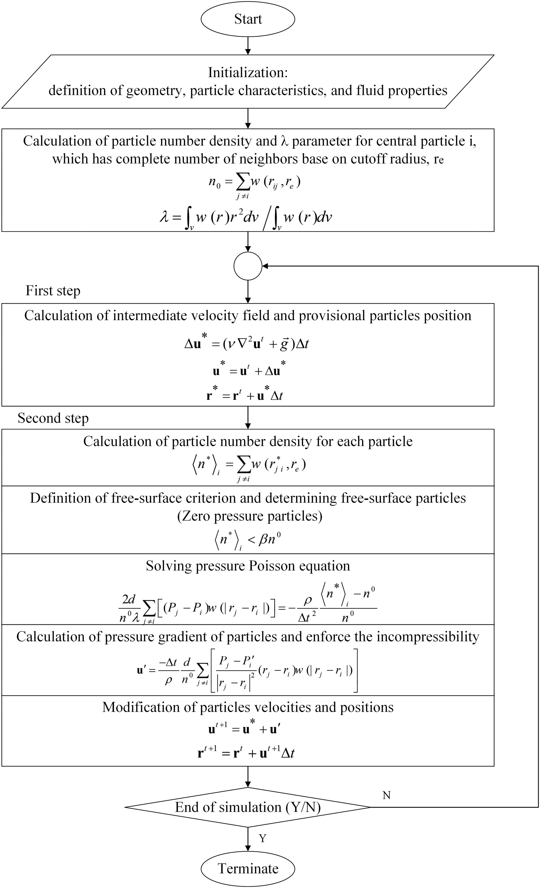

http://rlguy.com/gridfluidsim/
https://github.com/nepluno/apic2d
https://yunfei.work/apic2d/
https://github.com/rdzhao/FluidImplicitParticle

### Moving particle semi-implicit (MPS)

或者叫:**Moving Particle Simulation**

MPS 方法用于求解拉格朗日框架中的 Navier-Stokes 方程。应用了分数步法，该方法包括将每个时间步分为预测和校正两个步骤。流体用粒子表示，每个粒子的运动是通过核函数根据与相邻粒子的相互作用来计算的。MPS 方法类似于 SPH（平滑粒子流体动力学）方法（Gingold 和 Monaghan，1977；Lucy，1977），因为这两种方法都提供了对偏微分方程的强形式的近似（偏微分方程）基于积分插值。然而，MPS 方法应用了简化的微分算子模型仅基于局部加权平均过程，而不采用核函数的梯度。此外，MPS 方法的求解过程与原始 SPH 方法的求解过程不同，因为 PDE 的解是通过半隐式预测校正过程获得的，而不是原始 SPH 方法中的完全显式过程。

MPS 算法:

[图片出处](https://iwaponline.com/jh/article/20/6/1268/38894/Moving-particle-semi-implicit-method-with-improved)

PIC/FLIP

#### Particle-In-Cell (PIC)

#### Fluid-Implicit-Particle (FLIP)

#### Affine Particle-In-Cell (APIC)

#### Marker-and-Cell Method (MAC)

http://www.thevisualroom.com/marker_and_cell_method.html
Projection method (fluid dynamics)
http://plaza.ufl.edu/ebrackear/
