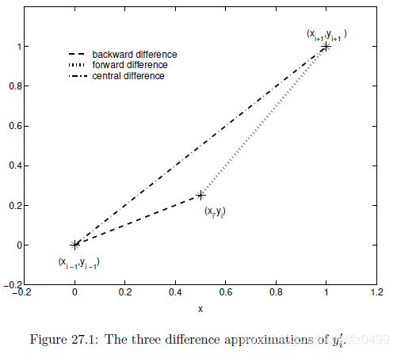

#### 对流方程

http://blog.jamiejquinn.com/webgl-fluid-1

https://nbviewer.org/github/barbagroup/CFDPython/blob/master/lessons/01_Step_1.ipynb

用于一维和二维中的线性、非线性对流、Burger 和泊松方程的 Python 脚本、使用标准壁函数的一维扩散方程、使用 Dirichlet 和 Neumann BC 的二维热传导对流方程、完整的 Navier-Stokes 方程以及腔的 Poisson 方程和二维通道流。

有限差分法求解无量纲一维对流扩散

2D Burger's Equation (Convection + Diffusion)

偏微分方程数值解
https://www.bilibili.com/video/av20999595/

微分方程数值分析基础教程 林群 pdf

### 一 偏微分方程

#### 1 热方程（抛物线方程）

$$
\frac{\partial w}{\partial t}-\frac{\partial^2w}{\partial x^2}=0
$$

#### 2 波动方程(双曲方程)

Wave equation/双曲偏微分方程(Hyperbolic partial differential equation)

$$
\frac{\partial^2 u}{\partial t^2}-\frac{\partial^2 u}{\partial x^2 }=0
$$

#### 3 拉普拉斯方程（椭圆方程）

$$
\frac{\partial^2 u}{\partial x^2}+\frac{\partial^2 u}{\partial y^2 }=0
$$

#### 有限差分格式

前向差分:

$$
y_i' = \frac{y_{i+1} - y_i}{x_{i+1}-x_{i}}
$$

后向差分:

$$
y_i' = \frac{y_{i} - y_{i-1}}{x_{i}-x_{i-1}}
$$

中心差分:

$$
y_i' = \frac{y_{i+1} - y_{i-1}}{2h}
$$

三种差分示意图:

中心差分格式, 一般用于扩散项
迎/逆风差分, 用于对流项

[工程师的数值方法](https://folk.ntnu.no/leifh/teaching/tkt4140/)

-   迎风差分(upwind difference)
-   Lax-Wendroff 格式
-   Maccormack 格式

逆风:
https://ocw.mit.edu/courses/aeronautics-and-astronautics/16-90-computational-methods-in-aerospace-engineering-spring-2014/numerical-methods-for-partial-differential-equations/upwinding-and-the-cfl-condition/

https://folk.ntnu.no/leifh/teaching/tkt4140/._main070.html

#### 离散流体

Volume of fluid method(体积流体法)
Level-set method(水平集法)
Marker-and-cell method(标记和单元方法)
particle-in-cell(PIC)
Fluid-Implicit-Particle (FLIP)
