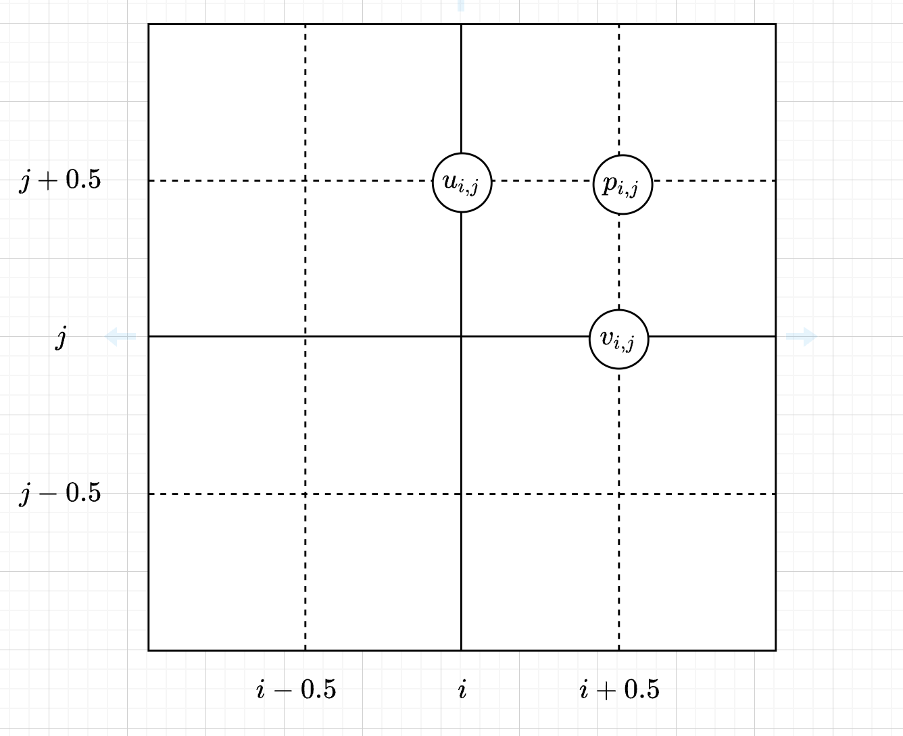

> https://www.cs.ubc.ca/~rbridson/docs/zhu-siggraph05-sandfluid.pdf

#### 交错的 MAC 网格

> http://www.thevisualroom.com/marker_and_cell_method.html



标量:

$$
p_{i,j} = (i + 0.5, j + 0.5)
$$

二维速度向量$(u,v)$:

$$
u_{i,j} = (i,j+0.5) \\
v_{i,j} = (i+0.5,j) \\
$$

网格的尺寸和分辨率

```js
gridWidth: 40;
gridHeight: 20;
gridDepth: 20;

gridResolutionX: 32;
gridResolutionY: 16;
gridResolutionZ: 16;
```

#### 1 将粒子传输到网格

fluid implicit particle(FLIP)
http://kbladin.se/dmt_projects/fluid_simulation.php
https://github.com/tunabrain/gpu-fluid
https://github.com/kbladin/Fluid_Simulation

基于 GPU 的 Web 模拟:
https://www.ibiblio.org/e-notes/webgl/gpu/contents.htm

todo:
Material Point Method(MPM)

#### webgl 处理粒子位置:

https://webgl2fundamentals.org/webgl/lessons/webgl-qna-how-to-process-particle-positions.html
